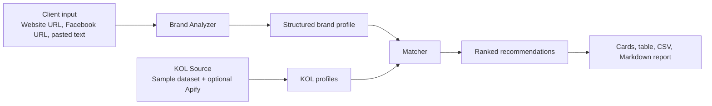

# TikTok KOL Matcher for Thai Market - Design Spec

Date: 2026-07-03

## Goal

Build a reliable demo prototype for Convert Cake's AI Engineer assessment. The app helps a digital marketing team analyze a client's website/Facebook presence and recommend relevant Thai TikTok KOLs for influencer marketing campaigns.

The prototype prioritizes a complete, stable Loom demo over fragile live scraping. It will run end-to-end with a built-in Thai KOL sample dataset, while also exposing optional production hooks for OpenAI and Apify.

## Scope

In scope:

- Streamlit local web app.
- Client input via website URL, Facebook URL, and optional pasted text.
- Thai cafe/restaurant demo preset.
- Brand profile extraction with OpenAI API when configured and heuristic fallback when not.
- KOL sourcing from a sample Thai KOL dataset, with optional Apify/TikTok hook when `APIFY_TOKEN` is configured.
- Ranked TikTok KOL recommendations with profile links.
- Top KOL cards, detailed ranking table, CSV export, and Markdown report export.
- README setup instructions, demo flow, and ethical/privacy notes.
- Focused tests for analyzer fallback, scoring/ranking, and sample demo output.

Out of scope for the prototype:

- Guaranteed Facebook scraping behind login or anti-bot controls.
- Verified real-time TikTok audience demographics.
- Automated outreach, campaign booking, or payment workflows.
- Fully productionized identity, persistence, team collaboration, or campaign CRM features.

## Architecture

The app is a single Streamlit interface backed by small Python modules with clear boundaries:

Primary files:

- `app.py`: Streamlit UI and demo flow.
- `brand_analyzer.py`: URL/text extraction, OpenAI-based extraction, heuristic fallback.
- `kol_data.py`: sample dataset loader and optional Apify integration boundary.
- `matcher.py`: scoring, ranking, and explanation preparation.
- `reporting.py`: CSV and Markdown report generation.
- `data/sample_kols.csv`: Thai KOL sample dataset.
- `tests/`: focused unit and smoke tests.

## Data Flow

1. User enters a website URL, Facebook URL, and optional pasted content, or loads the cafe/restaurant demo preset.
2. The app attempts to fetch public text from website pages. Facebook fetches are best-effort and expected to fail on some pages, so pasted text and presets remain first-class fallbacks.
3. The brand analyzer produces a structured brand profile:
   - category
   - keywords
   - target audience
   - tone/content style
   - location signals
   - content pillars
4. The KOL data loader returns profile candidates. By default it uses the sample dataset. If `APIFY_TOKEN` is present, the Apify path can be used to enrich or replace sample results.
5. The matcher scores each KOL against the brand profile.
6. The UI displays recommended KOLs as cards and a detailed ranking table.
7. The user can export CSV and Markdown reports.

## Brand Analyzer

The analyzer has two modes:

- AI mode: If `OPENAI_API_KEY` exists, use the OpenAI API to summarize the brand into structured fields.
- Fallback mode: If no key exists or the API fails, use rule-based extraction from page text and pasted text.

Fallback extraction should identify Thai/English category and intent signals such as:

- food, cafe, restaurant, dessert, brunch, coffee
- location terms such as Bangkok, Chiang Mai, Phuket, Thonglor, Ari, Siam
- audience cues such as students, office workers, families, tourists
- style cues such as cozy, premium, affordable, aesthetic, family-friendly, nightlife

The app should show which mode was used so the Loom demo can explain the reliability design.

## KOL Dataset

The prototype will include 20-50 Thai TikTok KOL rows. Each row should contain:

- name
- TikTok handle
- TikTok profile URL
- niche/category tags
- content style tags
- location
- follower count
- average views
- engagement rate
- audience age range
- audience gender skew when available or estimated
- estimated cost tier
- brand safety/risk notes

For ethical clarity, sample demographic fields must be labeled as estimates or sample metadata.

## Optional Apify Hook

The Apify integration is a production path, not a hard dependency. If configured, it can call an Apify TikTok-related Actor through the Apify API or Python client and normalize results into the same KOL schema used by the sample dataset.

If the token is missing, quota is unavailable, or the Actor fails, the app falls back to the sample dataset and displays a non-blocking warning.

## Matching Model

The initial weighted score:

- niche/category fit: 30%
- content style and keyword fit: 25%
- engagement quality: 20%
- audience demographic fit: 15%
- Thailand/location fit: 10%

The matcher will produce:

- `match_score`: 0-100
- component scores
- short recommendation reason
- notes or risks

Engagement quality should avoid rewarding follower count alone. A smaller KOL with strong engagement and niche fit can outrank a large but generic account.

## UI Design

The Streamlit app will be a single-page workflow:

1. Client Input Panel
   - Website URL
   - Facebook Page URL
   - pasted brand/social content
   - load demo preset button
2. Brand Profile Summary
   - category, audience, tone, keywords, location, content pillars
3. Recommended KOL Cards
   - Top 5 KOLs with TikTok links, score, engagement, and recommendation reason
4. Detailed Ranking Table
   - score breakdown, demographics, location, cost tier, notes
5. Export Section
   - CSV download
   - Markdown report download

The Loom demo should follow this story: load cafe preset, analyze brand, rank KOLs, inspect score breakdown, export report, then explain how OpenAI and Apify can upgrade the prototype toward production.

## Error Handling

- Website URL fetch failure: continue with pasted text or demo preset.
- Facebook URL blocked: show a plain explanation and keep pasted text fallback.
- Missing `OPENAI_API_KEY`: use heuristic analyzer.
- OpenAI API error: use heuristic analyzer and show warning.
- Missing `APIFY_TOKEN`: use sample dataset.
- Apify error: use sample dataset and show warning.
- Missing KOL field: use `unknown`, default score component, or exclude only that component as appropriate.

No error in optional integrations should prevent the sample demo from producing TikTok profile links.

## Testing

Minimum tests:

- Brand analyzer fallback returns a structured profile for cafe/restaurant sample text.
- Matcher ranks a food/cafe KOL above unrelated categories for a cafe brand.
- Score components stay within expected ranges.
- Report generator includes TikTok profile links.
- Smoke test confirms the sample demo returns at least five ranked KOLs.

Manual verification:

- Run the Streamlit app locally.
- Load the cafe demo preset.
- Confirm Top 5 cards, detailed table, CSV export, and Markdown export render correctly.

## Ethics and Privacy

- Use public information only.
- Do not bypass login walls, private profiles, or platform access controls.
- Treat demographics in the prototype as sample estimates, not verified personal data.
- Include human review before final influencer selection.
- Do not present ranking as the only decision-making authority.
- Consider brand safety and content fit, not just engagement volume.

## External References

- Streamlit installation and local app workflow: https://docs.streamlit.io/get-started/installation and https://docs.streamlit.io/get-started/fundamentals/main-concepts
- OpenAI API documentation for text generation and structured outputs: https://platform.openai.com/docs
- Apify API documentation: https://docs.apify.com/api
- Apify Actors platform documentation: https://docs.apify.com/platform/actors
- Apify TikTok/Profile scraper examples: https://apify.com/clockworks/tiktok-scraper and https://apify.com/clockworks/tiktok-profile-scraper

## Acceptance Criteria

- A reviewer can run the app locally from README instructions.
- Without any API keys, the demo still analyzes the cafe preset and outputs at least five TikTok profile links.
- With `OPENAI_API_KEY`, brand profile extraction can use the AI path.
- With `APIFY_TOKEN`, the KOL source layer has a clear integration path.
- The app explains why each recommended KOL matches the client.
- The output includes both executive-friendly cards and a detailed ranking table.
- CSV and Markdown exports work.
- Tests cover the core fallback and ranking behavior.
